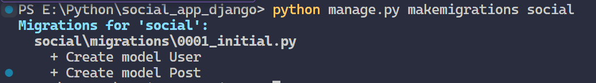
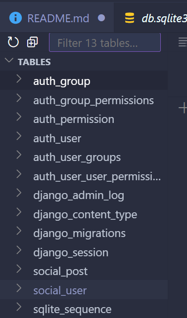
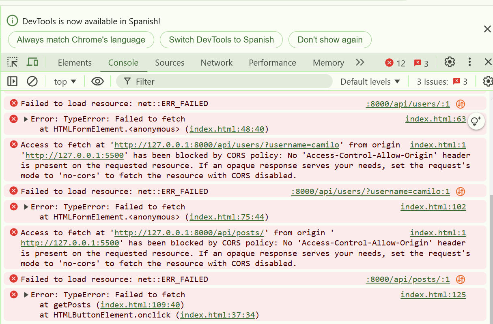
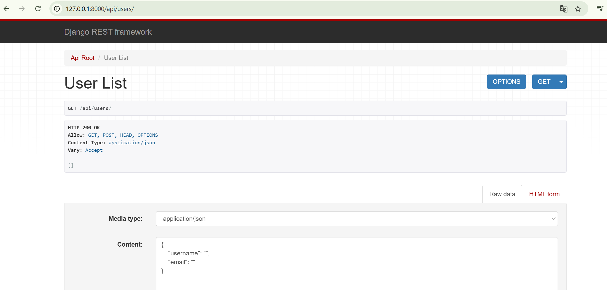

Pasos para configurar este prtoyecto

Paso 1: Configurar el Entorno de Desarrollo
Primero, abre tu terminal y sigue estos comandos.

Crear y activar un entorno virtual en Python:

    python3 -m venv socialenv
    source socialenv/bin/activate  # En Windows usa: socialenv\Scripts\activate

Instalar las dependencias básicas (Django, Flask y Django REST Framework): Ejecuta estos comandos en la terminal para instalar Django, Django REST Framework y Flask:

    pip install django djangorestframework flask

Generar el archivo requirements.txt: Este archivo contiene las versiones de todas las librerías instaladas para que puedas replicar el entorno en el futuro.

    pip freeze > requirements.txt

Paso 2: Configurar el Backend con Django
Crear el proyecto Django:

    django-admin startproject social_backend .   (El punto al final es para no repetir la creación del directorio)
    En este punto se puede levantar el servidor django con el comando -> python manage.py runserver

Paso 3: Crear y aplicar las migraciones: En una nueva terminal, sin necesidad de detener el servidor se van a realizar las migraciones necesarias para actualizar la bd que django proporciona:

    ejecutar los siguientes comandos:
    
    python manage.py migrate
    python manage.py makemigrations

Paso 4: Crear una aplicación Django para manejar los usuarios y publicaciones:Ahora desde el directorio raíz del proyecto creamos la aplicación que creará posts en un cliente

    Crear una aplicación Django para manejar los usuarios y publicaciones con el siguiente comando

    python manage.py startapp social

    Se puede ver que se ha creado un directorio llamado social

Paso 5: Definir los modelos de la aplicación: En social/models.py, crea los modelos básicos User y Post para los usuarios y publicaciones:

    from django.db import models

class User(models.Model):
    username = models.CharField(max_length=150, unique=True)
    email = models.EmailField(unique=True)

    def __str__(self):
        return self.username

class Post(models.Model):
    user = models.ForeignKey(User, on_delete=models.CASCADE)
    content = models.TextField()
    created_at = models.DateTimeField(auto_now_add=True)

    def __str__(self):
        return f"{self.user.username}: {self.content[:30]}..."

Paso 6: Crear y aplicar las migraciones: 
    python manage.py makemigrations social

Esto se realiza para actualizar la bd con el modelo creado, es probable que al ejecutar el comando salga error si no se ha actulizado el archivo social_backend/settings.py , para ello se agrega la apliación social al listado:

        INSTALLED_APPS = [
    'django.contrib.admin',
    'django.contrib.auth',
    'django.contrib.contenttypes',
    'django.contrib.sessions',
    'django.contrib.messages',
    'django.contrib.staticfiles',

    'social',
]

Ahora ejecutamos de nuevo : python manage.py makemigrations social

Si todo está correcto se debe ver cómo la imagen

    Ahora para actualizar la bd spython manage.py migratee ejecuta:

        python manage.py migrate

        Se debe ver algo así con las tablas creadas

    

Paso 7: Ahora actualizamos las aplicaciones en social_backend\settings.py e introducimos :

    INSTALLED_APPS = [
    'django.contrib.admin',
    'django.contrib.auth',
    'django.contrib.contenttypes',
    'django.contrib.sessions',
    'django.contrib.messages',
    'django.contrib.staticfiles',
    'rest_framework',  # Django REST framework
    'social',          # Aplicación social
]

Paso 8: Crear vistas para la API: En social/views.py, configura las vistas para manejar los endpoints de usuarios y publicaciones:

    from rest_framework import viewsets
from .models import User, Post
from .serializers import UserSerializer, PostSerializer

class UserViewSet(viewsets.ModelViewSet):
    queryset = User.objects.all()
    serializer_class = UserSerializer

class PostViewSet(viewsets.ModelViewSet):
    queryset = Post.objects.all()
    serializer_class = PostSerializer

Paso 9:Para que el paso anterior funcione correctamente se debe crear un archivo de serializers para API REST: En social/serializers.py, define los serializers para convertir los datos del modelo en formato JSON:

Paso 10: Configurar las rutas de la API: En social/urls.py (se debe crear el archivo), agrega las rutas usando un enrutador REST:

    from django.urls import path
    from rest_framework.routers import DefaultRouter
    from . import views

    router = DefaultRouter()
    router.register(r'users', views.UserViewSet, basename='user')
    router.register(r'posts', views.PostViewSet, basename='post')

    urlpatterns = router.urls

Y en social_backend/urls.py, incluye las rutas de social:

      from django.contrib import admin
    from django.urls import path, include

    urlpatterns = [
    path('admin/', admin.site.urls),
    path('api/', include('social.urls')),  # Incluye las rutas de la aplicación social
]

Ahora se debe poder acceder a las rutas y verificar la información de la API en ambas tablas:

Paso 11: Probar las Rutas de API
Inicia el servidor de Django si aún no lo has hecho:

python manage.py runserver
Verifica las rutas disponibles:

Navega a http://127.0.0.1:8000/api/users/ para ver la lista de usuarios.
Navega a http://127.0.0.1:8000/api/posts/ para ver la lista de publicaciones.

Paso 12: creamos un frontedn de prueba el cual pueda consumir los datos de la API ( ver directorio de forntend)

    Es probable que al hacer las peticiones haya una política de cors que nos de problemas:

        

Paso 13: Instalar django-cors-headers
Detén el servidor Django y, en el entorno virtual donde tienes tu proyecto, instala django-cors-headers:

        pip install django-cors-headers

    Agrega corsheaders a las aplicaciones instaladas en social_backend/settings.py:

        INSTALLED_APPS = [
    # ...
    'corsheaders',
    'rest_framework',
    'social',
    # otras apps
]

    Agregar middleware de CORS: En settings.py, agrega el middleware de corsheaders antes de cualquier middleware de seguridad o autenticación. Agrega esta línea al inicio de la lista de MIDDLEWARE:

    
    
  # estos primeros son los que se agregan para el cors: ver https://pypi.org/project/django-cors-headers/

    MIDDLEWARE = [
    'corsheaders.middleware.CorsMiddleware', 
    'django.middleware.common.CommonMiddleware',

    'django.middleware.security.SecurityMiddleware',
    'django.contrib.sessions.middleware.SessionMiddleware',
    'django.middleware.common.CommonMiddleware',
    'django.middleware.csrf.CsrfViewMiddleware',
    'django.contrib.auth.middleware.AuthenticationMiddleware',
    'django.contrib.messages.middleware.MessageMiddleware',
    'django.middleware.clickjacking.XFrameOptionsMiddleware',
]

Luego se deben actualizar los permisos de los origins en social_backend\settings.py (se agrega al final del fichero)
aquí agrega la ruta de tu frontend ( en mi caso liveserver lo levanta en http://127.0.0.1:5500/ se pueden agragar varios)

CORS_ALLOWED_ORIGINS = [
    
    "http://127.0.0.1:5500",
    
]

Se ejecuta el servidor nuevamente 
    python manage.py runserver

Ahora ponemos a prueba la aplicación:

Abramos la ruta de users para verificar que está vacío:

Ahora desde el frontend creamos el usuario:

luego verificamos que el usuario también se ha creado en el gestor de la API de django

Ahora si deseamos borrar el registro navegamos ala ruta de l id 1 y desde allí se puede eliminar:

Ahora creamos un post y lo verificamos tanto en el cleinte como en el servidor

